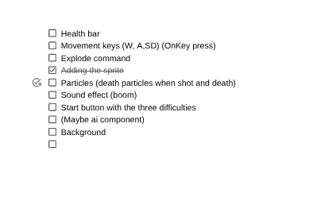

# Entry 4
## 3/9/26

From my last blog entry I was still learning some finishing touches of the code and now I have done a few more lessons to get the main componets of my game. Like I said from my last blog entry I have searched a bunch of these topics that would be importnat for my project. This was one of the last components that I needed which was health bar. I am at the momment planning out how I want my game right now and I am using a google doc to help me plan where I want things like the requirnemnts that I am going to need to create the game. I was planning to do a checklist of my requirments because the plan is useful for keeping track of dates but I wanted a seperate sheet of paper so I can check off the requirments like this page needs this andd that. It makes it easier to read I feel like and shows me what I am missing and if I have done that specific task on it I just put a check mark on it. So far I went through some of the topics in my learning log that I would have to add and it looks like this. 



---

Since I have started planning I have one topic left which is adding a ai component to play with but I plan on doing that later on and incoperating it later on so I have something to add for my learning log also. I so far have completed one lesson after the last blog entry which was health bars and I learned this through the [kaboom website](https://kaboomjs.com/#health). I started working with some of the regular starter code that it gave and I tinkered in jsbin. After getting a jist of wht I was learning I then tried to incoperate this into my practice code that I had making a health bar and this is waht I looked at. 

```js
 const healthBar = add([
      rect(40, 6),
      pos(player.pos.x - 20, player.pos.y - 30),
      color(0, 255, 0),
      "healthBar"
  ]);
```
I first created the health bar itself and the position where I wanted the health bar to be, including the shape. This was the easy part as it was copying and pasting almost. After this I created the end where the charcter will die 

```js
 if (player.health <= 0) {
        destroy(player);
        wait(100, () => go("game"));
    }
```
However the next part was really tricky for me because as in a way I had to create a conditional for if the player does this or that the health bar will drop. I created this code which was basically just the health bar color and if it reaches a certain health limit the color will go down jsut like in games when you get low health it will turn red. I then set the damage it would take per hit, I first tested this out using the `onKeyPress` where I pressed the key d it would decrease the health bar down. While I was doing this code I ran into a issue which was trying to update the health bar which when I clicked D once it only worked once and after it did not update the health bar. My code looked like this in the beginning. 

```js
healthBar.pos = player.pos.add(vec2(-20, -30));
healthBar.width = 100 * (player.health / 2);
```

---
I tried thinking of ways to make it update after each click on D and I came up with using `onUpdate` which basically just does what I want it to do, updating the health bar when I click D. I created a conditonal where if it reaches a certain health it would turn red and it will also update the health bar merging everything into one and it looked like this.

---

```js
onUpdate(() => {
      healthBar.pos = player.pos.add(vec2(-20, -30));
      healthBar.width = 100 * (player.health / 2);

      if (player.health < 30) {
          healthBar.color = rgb(255, 0, 0); 
      } else if (player.health < 60) {
          healthBar.color = rgb(255, 165, 0); 
      } else {
          healthBar.color = rgb(0, 255, 0); 
      }
});
```
This finished the part I had for health bars and I even tested it out and it worked when I clicked D so now I am going to move onto developing my product. 

---

# Engineering Design Process
Right now on the engineering design process I have moved over one step from basically planning my process and everything and now taking all that information now comibing it into making step 5 of the engineering design process which is creating the prototype of the MVP for now. I have jsut started to create this and it is going to take some time to develop the protoype and I am going to be here untill around maybe the end of April or a little earlier. I started creating the background and also even created the different difficulties modes, incluidng the sprites that I want to be in the game. I am thinking to choose set sprites or find a way to let the user choose, but for now I have created some set sprites to hold as a placeholder. I am happy with my progress so far and I just need to inch closer and closer to the final product and try to go beyond the MVp after. 


[Previous](entry03.md) | [Next](entry05.md)

[Home](../README.md)
